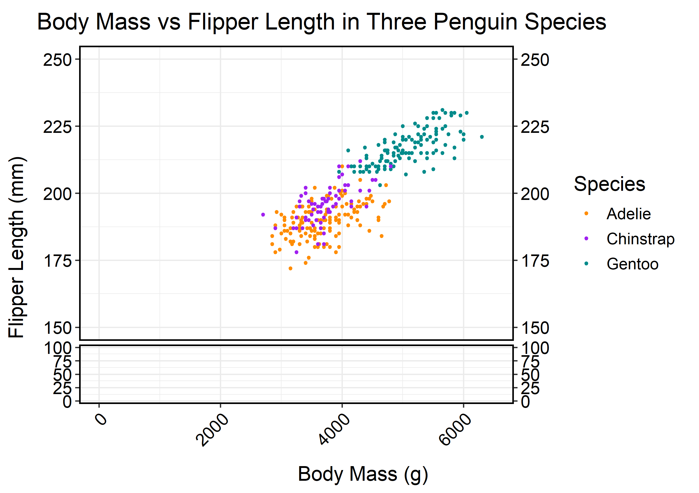
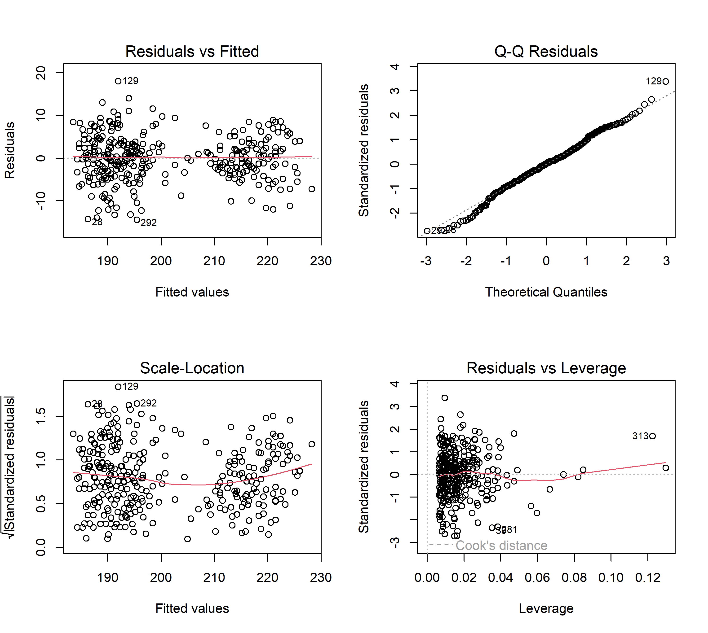
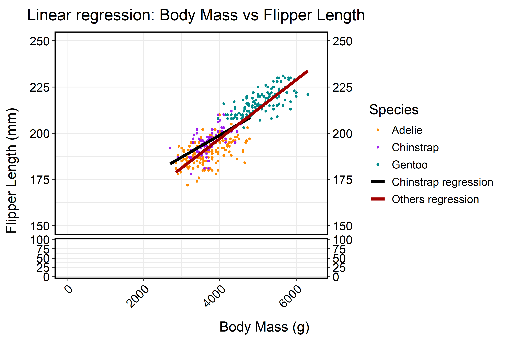

```{r setup, include=FALSE}
knitr::opts_chunk$set(echo = TRUE, dev = 'svglite', 
                      fig.ext = 'svg')
options(knitr.svg.object = TRUE)
```

## Initialization 

```{r loading of packages and data, eval=TRUE, warning=FALSE, message=FALSE}
# loading of premade R packages
library(tidyverse)
library(here)
library(palmerpenguins)
library(janitor)
library(ragg)
library(svglite)
library(plot3D)
library(ggbreak)

# loading custom functions
source(here("Functions", "cleaning.R"))
source(here("Functions", "plotting.R"))
source(here("Functions", "penguins.R"))

# loading, cleaning and saving backups of Data
write.csv(penguins_raw, here("Data","penguins_raw.csv"))

penguins_clean <- cleaning(penguins_raw,c("Comments", "Delta"))

write.csv(penguins_clean, here("data","penguins_clean.csv"))
```

*The following is a template .rmd RMarkdown file for you to use for your homework submission.*

*Please Knit your .rmd to a PDF format or HTML and submit that with no identifiers like your name.*

*To create a PDF, first install tinytex and load the package. Then press the Knit arrow and select "Knit to PDF".*

## QUESTION 01: Data Visualisation for Science Communication

*Create a figure using the Palmer Penguin dataset that is correct but badly communicates the data. **Do not make a boxplot**.*

*Use the following references to guide you:*

-   [*https://www.nature.com/articles/533452a*](https://www.nature.com/articles/533452a){.uri}
-   [*https://elifesciences.org/articles/16800*](https://elifesciences.org/articles/16800){.uri}

*Note: Focus on visual elements rather than writing misleading text on it.*

### a) Provide your figure here:

```{r bad figure code, echo=FALSE}

### creation of quite possibly the worst graph known to humanity
# setting up parameters for saving a beautiful crisp PNG
png(filename = here("Figures", "Ugly graph.png"), 
    width = 12, height = 12, units = "cm", res = 80)
# Ugly, hard to follow code, with no breaking up or annotations just to rub in how terrible this is, this feels illegal
scatter3D(penguins_clean$sample_number, penguins_clean$body_mass_g,log(penguins_clean$flipper_length_mm), colvar = penguins_clean$culmen_depth_mm, pch = 19, cex = 0.5, clab = "Culmen depth", xlab = "sample number",ylab = "Body mass", zlab = "flipper length", colkey = list(side = 4, plot = TRUE, length = 0.5, width = 1, dist = -0.25,shift = 0, addlines = FALSE, col.clab = NULL, cex.clab = par("cex.lab"),side.clab = NULL, line.clab = NULL, adj.clab = NULL, font.clab = NULL), bg.col = "white", col.panel = "white")
  dev.off()
```

{width="612"}

### b) Write about how your design choices mislead the reader about the underlying data (200-300 words).

*Include references.*

This monstrosity is plotting Flipper length against body mass but makes a lot of classic graph errors making it almost impossible to see what's going on. First of all, there is very little information given about the graph. There is no title, and the caption underneath also provides no information about what the graph shows. The axes are poorly labelled, with no units or axis points, making it almost meaningless. The text is also at strange angles and often overlapping making it very difficult to read. The data itself is also very hard to read.

The graph is three-dimensional and has no gridlines making the locations of points impossible to judge on any of the axes. One of the Values is shown through colour, which is difficult again to get qualitative readouts from, and inaccessible to colour-blind people. The legend for this colour completely covers some data points as well. None of these axes start from zero, even though you can't see this, which could exaggerate some relationships. The flipper length variable is also unnecessarily log-transformed, yet again, this is not mentioned anywhere. There is also just far too much unnecessary data thrown into one graph. The culmen depth does not need to be there and only confuses the reader as to the relationship between flipper length and body mass. And sample number isn't a proper reading and also shouldn't be there.

Finally, the graph is coded terribly. No annotations or splitting up of the code makes it very difficult to read and edit. There are lots of unnecessary bits of code making it inefficient. And it outputs a terrible, low-quality PNG as the icing on the cake making an already terrible graph even harder to see. I can only apologize for what I have produced.

------------------------------------------------------------------------

## QUESTION 2: Data Pipeline

*Write a data analysis pipeline in your .rmd RMarkdown file. You should be aiming to write a clear explanation of the steps, the figures visible, as well as clear code.*

*Your code should include the steps practiced in the lab session:*

-   *Load the data*

-   *Appropriately clean the data*

-   *Create an Exploratory Figure (**not a boxplot**)*

-   *Save the figure*

-   ***New**: Run a statistical test*

-   ***New**: Create a Results Figure*

-   *Save the figure*

*An exploratory figure shows raw data, such as the distribution of the data. A results figure demonstrates the stats method chosen, and includes the results of the stats test.*

*Between your code, communicate clearly what you are doing and why.*

*Your text should include:*

-   *Introduction*

-   *Hypothesis*

-   *Stats Method*

-   *Results*

-   *Discussion*

-   *Conclusion*

*You will be marked on the following:*

### a) Your code for readability and functionality

### b) Your figures for communication

### c) Your text communication of your analysis

*Below is a template you can use.*

------------------------------------------------------------------------

```{r initialisation, eval=TRUE}
library(tidyverse)
library(here)
library(palmerpenguins)
library(janitor)
library(ragg)
library(svglite)
library(plot3D)
library(ggbreak)

# loading custom functions
source(here("Functions", "cleaning.R"))
source(here("Functions", "plotting.R"))
source(here("Functions", "penguins.R"))
```

### Introduction

There is likely to be a positive relationship between body mass and flipper length. However, This relationship could take many forms, being linear, logarithmic, exponential etc. This relationship may be universal between all penguin species, or may be different for each species.

This analysis aims to understand the relationship between body mass and flipper length in multiple penguin species using the "Palmer Penguins" dataset. This data set contains 344 penguins from three species: Adelie, Chinstrap and Gentoo collected between 2007 and 2009 from the Palmer archipelago [@horst2022]. The Raw data is shown in Figure 1.

```{r Data Exploration, warning=FALSE, message=FALSE}
# loading, cleaning and saving data
write.csv(penguins_raw, here("Data", "penguins_raw.csv"))

penguins_clean <- cleaning(penguins_raw, c("Comments", "Delta"))

write.csv(penguins_clean, here("data", "penguins_clean.csv"))

# removing datapoints with NA values for the variables of interest
penguins_MVF <- penguins_clean %>% drop_na(body_mass_g,
                                           flipper_length_mm,
                                           species)
write.csv(penguins_MVF, here("data", "penguins_MVF.csv"))

# creation and saving of explorative using a self made function in "penguins.R"
scatterplot(penguins_MVF, penguins_MVF$body_mass_g, 
                       "Body Mass (g)", 
                       penguins_MVF$flipper_length_mm, 
                       "Flipper Length (mm)", penguins_MVF$species,
                       "Species", "Body Mass vs Flipper Length in Three Penguin Species", 
                       FALSE, "Exploratory plot.png", 12, 17, 400)

```

{width="700"}

\-

From initial visualisation of the data, it appears that there is a strong linear correlation between the two variables with no variation between species.

\-

### Hypothesis

Our hypothesis is that there is a linear correlation between these two variables, and the relationship is the same between all three species in the dataset.

To test this a multiple linear regression will and an ANCOVA analysis will be run with these hypotheses:

H~0~: There is no relationship between body mass and flipper length (null model: y = 200.9152)

H~1~: There is a linear relationship between body mass and flipper length, potentially varying between species (model as described by multiple linear regression)

\-

### Statistical Methods

First we created the multiple linear model and tested it's assumptions using the diagnostic plots in Figure 2.

```{r Statistics}
# Creation of a linear model includingcomparing flipper length to body mass, species and the interaction between the two
Model <- lm(flipper_length_mm ~ body_mass_g + species + 
              body_mass_g*species, data = penguins_MVF)
 
# defining parameters for saving diagnostic plots
png(here("Figures", "Diagnostic Plots.png"), width = 19,
          height = 17, units = "cm", res = 400)
# creation of multiplot
par(mfrow=c(2,2))
DiaPlots <- (plot(Model,1) | plot(Model,2)) / (plot(Model,3) | plot(Model,5))
dev.off()
```

{width="700"}

\-

-   The residuals vs fitted plot shows that they are linear and show homoscedasticity, there are two distinct groups, but this is due to limited data points between the values of 200 and 210

-   The normal Q-Q plot shows a close match to normality and so this definitely fits that assumption of the linear model

-   The scale-location plot potentially hints at a bit of heteroscedasticity, but I don't believe it is enough to violate the assumptions of the linear model when considering the other three plots

-   The residuals vs leverage plot shows that there are no particularly influential outliers

Overall, these plots demonstrate that none of the assumptions of the linear model have been broken and we can continue with the analyses [@whitlock2020analysis] .

```{r Statistical analysis}
# statistical analysis of the linear model
summary(Model)
```

This shows that the relationship between body mass and flipper length is highly significant. It also shows that theinteraction between the body mass and chinstrap species factors is also significant. With the model being able to account for 85.53% of the variability [@whitlock2020analysis].

\-

### Results & Discussion

This means that All species show a linear relationship between body mass and flipper length. And that while the exact relationship is likely shared between Adelie and Gentoo penguins, the Chinstrap penguins appear to have a different relationship. These regression lines are shown in Figure 3 and a summary of the results is shown in Figure 4.

```{r Plotting Results, warning=FALSE, message=FALSE}
# displaying the coefficient for the linear regression
RegLines <- coef(Model)
paste("Adelie and Gentoo: y =", round(RegLines[2] , 4), "* x +", round(RegLines[1], 4))
paste("Chinstrap: y =", round((RegLines[2] + RegLines[5]), 4), "* x +", round((RegLines[1] + RegLines[3]), 4))


# create and save a plot of results
scatterplot(penguins_MVF, penguins_MVF$body_mass_g, 
                       "Body Mass (g)", 
                       penguins_MVF$flipper_length_mm, 
                       "Flipper Length (mm)", penguins_MVF$species, 
                       "Species", "Linear regression: Body Mass vs Flipper Length", 
                       TRUE, "Results plot.png",  12, 18, 400)

```

{width="700"}

\-

| Effect                 | Estimate | Standard Error | T value | P value |
|------------------------|----------|----------------|---------|---------|
| Body mass              | 6.677e-3 | 9.523e-4       | 7.011   | 1.3e-11 |
| Body mass \* Chinstrap | 5.228e-3 | 1.949e-3       | 2.683   | 0.00766 |

: Figure 4: Table summarising the results of the analysis

### Conclusion

This analysis demostrates the incredibly tight relationship between body mass and flipper length in these penguin species. This suggests the importance of having larger flippers to amassing a larger body mass. Larger flippers would allow for greater propulsion underwater and could potentially have other roles on land such as signalling, wheras flippers too large for their body could become an encumberance. Keeping these flippers consistent to their body mass must be important for these functions.

The significant interaction between species and body mass in this analysis also shows that this relationship differs between different species. This suggests that different species place a greater or smaller importance on this relationship. This could be due to differences in development or lifestyles. Penguins which use their flippers more for communication may still want to maintain these larger flippers even with a lower mass, reducing the gradient of the relationship.

With over 85% of the variability of penguin flipper sizes being able to be explained by body mass, species and the interaction between the two, these factors are the primary determinants of flipper size. More research is necessary to understand what the benefit of this relationship is and how it is maintained. Looking into more species and comparing the relationship between mass and flipper size to their lifestyles could give us more information about what benefits this relationship holds. And using a GWAS analysis on a variety of penguins with different flipper sizes we could understand some of the genetic mechanisms underpinning this interaction.

------------------------------------------------------------------------

## QUESTION 3: Open Science

### a) GitHub

*Upload your RProject you created for **Question 2** and any files and subfolders used to GitHub. Do not include any identifiers such as your name. Make sure your GitHub repo is public.*

*GitHub link:*

<https://github.com/The-Nedstar/ReproducableFigures>

*You will be marked on your repo organisation and readability.*

### b) Share your repo with a partner, download, and try to run their data pipeline.

*Partner's GitHub link:*

<https://github.com/awesomeorangutan/Reproducible_Science> 

*You **must** provide this so I can verify there is no plagiarism between you and your partner.*

### c) Reflect on your experience running their code. (300-500 words)

Overall, their code worked well. There were no issues with any of the code chunks not functioning and it could knit with no problem. Throughout the document there were clear descriptions of what was going on both outside the code blocks as blocks of text and within the code as comments and annotation. It was easy to tell what was going on in the code as it was clearly laid out and described.

I think some of their code was a bit inefficient in areas. There was quite a bit of repeated and unnecessary code. Use of more functions could have allowed for shorter and neater code chunks and the functions which were created could have been set up with far more inputs to allow them to be used in multiple different ways. The functions creating graphs also took many variables from the environment which were not called by the function. This is generally bad practice as it makes the functions less likely to work when used in other situations. On top of this I felt some variable names were overly long, although very easy to read this would make the code harder to work with.

The graphs where quite difficult to alter with only the dataset being called by the function. The only thing you can edit is the dataset that the graph is based on, but becuase nothing else can change it is incredibly unlikely that the graph would function with a different dataset input, so there is essentially nothing that can be changed without editing the function itself. Inside the function it is very easy to follow and changes can be made easily, but it takes a long time to go back and forward between the function file and the markdown file where the function is used to change and test diffferent things. If I wanted to create a new graph using the same function without replacing the old graph, then a whole new function would need to be created without editing the old function, this is very inefficient. This is the main aspect of the code which I would change, otherwise It functioned very well and was clearly laid out.

### d) Reflect on your own code based on your experience with your partner's code and their review of yours. (300-500 words)

They said that my code also ran easily and was well annotated. I think they were happy with the overall layout, wording and annotation. Except the block titled "DO NOT TOUCH" which they did touch and said it wasn't seperated and labelled clearly enough. Potentially I shouldn't have included this at all, as if renv had not been restored before someone ran it then it would delete all of the packages and they would have to be installed again, not good.

One issue with my code was the plot3D library. They were running the project on a Mac and this library requires specialist software to use on a Mac. This library was not used within the datapipeline itself and was there for question 1, so In the case that this pipeline was being created as a standalone document rather than a part of a predetermined exam template this wouldn't have been an issue. Nonetheless this limits the reproducability of my code as in it's current state if someone opens it on a Mac they may struggle to run it.

They liked the functions structure that I used and I was glad that they still worked when the inputs and environment had been modified making them reusable. The graph function in particular was very easy for them to modify how the graph would look without needing to open the functions file at all which I was very pleased with. However, when opening the function itself they found it quite overwhelming, not understanding some of the more complex code such as the if statements making it difficult for someone with limited coding experience to modify.

I've learnt that creation of many functions that can be used in a variety of settings is really important for code reproducability. Trying to modify their figures compared to watching them modify mine showed the power of versatile functions. And I wish I had doubled down on this aspect of the function so it could be varied even further without needing to open the file containing the function. I also learnt the importance of clear variable names, although I thought theirs were too long, they really struggled to understand any of mine as they were too truncated. Finding the balance between useability and understandability is vital for other people to use and modify your code.

------------------------------------------------------------------------
