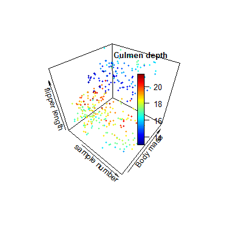

```{r setup, include=FALSE}
knitr::opts_chunk$set(echo = TRUE)
```

## Initialization

```{r loading of packages and data, eval=TRUE, warning=FALSE, message=FALSE}
# loading of premade R packages
renv::restore()
library(tidyverse)
library(here)
library(palmerpenguins)
library(janitor)
library(ragg)
library(svglite)
library(plot3D)
library(ggbreak)

# loading custom functions
source(here("Functions", "cleaning.R"))
source(here("Functions", "plotting.R"))
source(here("Functions", "penguins.R"))

# loading, cleaning and saving backups of Data
write.csv(penguins_raw, here("Data","penguins_raw.csv"))

penguins_clean <- cleaning(penguins_raw,c("Comments", "Delta"))

write.csv(penguins_clean, here("data","penguins_clean.csv"))
```

*The following is a template .rmd RMarkdown file for you to use for your homework submission.*

*Please Knit your .rmd to a PDF format or HTML and submit that with no identifiers like your name.*

*To create a PDF, first install tinytex and load the package. Then press the Knit arrow and select "Knit to PDF".*

## QUESTION 01: Data Visualisation for Science Communication

*Create a figure using the Palmer Penguin dataset that is correct but badly communicates the data. **Do not make a boxplot**.*

*Use the following references to guide you:*

-   [*https://www.nature.com/articles/533452a*](https://www.nature.com/articles/533452a){.uri}
-   [*https://elifesciences.org/articles/16800*](https://elifesciences.org/articles/16800){.uri}

*Note: Focus on visual elements rather than writing misleading text on it.*

### a) Provide your figure here:

```{r bad figure code, echo=FALSE}

### creation of quite possibly the worst graph known to humanity
# setting up parameters for saving a beautiful crisp PNG
png(filename = here("Figures", "Ugly graph.png"), 
    width = 5, height = 5, units = "in", res = 80)
# Ugly, hard to follow code, with no breaking up or annotations just to rub in how terrible this is, this feels illegal
scatter3D(penguins_clean$sample_number, penguins_clean$body_mass_g,log(penguins_clean$flipper_length_mm), colvar = penguins_clean$culmen_depth_mm, pch = 19, cex = 0.5, clab = "Culmen depth", xlab = "sample number",ylab = "Body mass", zlab = "flipper length", colkey = list(side = 4, plot = TRUE, length = 0.5, width = 1, dist = -0.25,shift = 0, addlines = FALSE, col.clab = NULL, cex.clab = par("cex.lab"),side.clab = NULL, line.clab = NULL, adj.clab = NULL, font.clab = NULL), bg.col = "white", col.panel = "white")
  dev.off()
```

{width="612"}

### b) Write about how your design choices mislead the reader about the underlying data (200-300 words).

*Include references.*

This monstrosity is plotting Flipper length against body mass but makes a lot of classic graph errors making it almost impossible to see what's going on. First of all, there is very little information given about the graph. There is no title, and the caption underneath also provides no information about what the graph shows. The axes are poorly labelled, with no units or axis points, making it almost meaningless. The text is also at strange angles and often overlapping making it very difficult to read. The data itself is also very hard to read.

The graph is three-dimensional and has no gridlines making the locations of points impossible to judge on any of the axes. One of the Values is shown through colour, which is difficult again to get qualitative readouts from, and inaccessible to colour-blind people. The legend for this colour completely covers some data points as well. None of these axes start from zero, even though you can't see this, which could exaggerate some relationships. The flipper length variable is also unnecessarily log-transformed, yet again, this is not mentioned anywhere. There is also just far too much unnecessary data thrown into one graph. The culmen depth does not need to be there and only confuses the reader as to the relationship between flipper length and body mass. And sample number isn't a proper reading and also shouldn't be there.

Finally, the graph is coded terribly. No annotations or splitting up of the code makes it very difficult to read and edit. There are lots of unnecessary bits of code making it inefficient. And it outputs a terrible, low-quality PNG as the icing on the cake making an already terrible graph even harder to see. I can only apologize for what I have produced.

------------------------------------------------------------------------

## QUESTION 2: Data Pipeline

*Write a data analysis pipeline in your .rmd RMarkdown file. You should be aiming to write a clear explanation of the steps, the figures visible, as well as clear code.*

*Your code should include the steps practiced in the lab session:*

-   *Load the data*

-   *Appropriately clean the data*

-   *Create an Exploratory Figure (**not a boxplot**)*

-   *Save the figure*

-   ***New**: Run a statistical test*

-   ***New**: Create a Results Figure*

-   *Save the figure*

*An exploratory figure shows raw data, such as the distribution of the data. A results figure demonstrates the stats method chosen, and includes the results of the stats test.*

*Between your code, communicate clearly what you are doing and why.*

*Your text should include:*

-   *Introduction*

-   *Hypothesis*

-   *Stats Method*

-   *Results*

-   *Discussion*

-   *Conclusion*

*You will be marked on the following:*

### a) Your code for readability and functionality

### b) Your figures for communication

### c) Your text communication of your analysis

*Below is a template you can use.*

------------------------------------------------------------------------

```{r initialisation, eval=TRUE}
renv::restore()
library(tidyverse)
library(here)
library(palmerpenguins)
library(janitor)
library(ragg)
library(svglite)
library(plot3D)
library(ggbreak)

# loading custom functions
source(here("Functions", "cleaning.R"))
source(here("Functions", "plotting.R"))
source(here("Functions", "penguins.R"))
```

### Introduction

```{r Data Exploration, warning=FALSE, message=FALSE}
# loading, cleaning and saving data
write.csv(penguins_raw, here("Data", "penguins_raw.csv"))

penguins_clean <- cleaning(penguins_raw, c("Comments", "Delta"))

write.csv(penguins_clean, here("data", "penguins_clean.csv"))

# removing datapoints with NA values for the variables of interest
penguins_MVF <- penguins_clean %>% drop_na(body_mass_g,
                                           flipper_length_mm,
                                           species)
write.csv(penguins_MVF, here("data", "penguins_MVF.csv"))

# creation and saving of explorative using a self made function in "penguins.R"
scatterplot(penguins_MVF, penguins_MVF$body_mass_g, 
                       "Body Mass (g)", 
                       penguins_MVF$flipper_length_mm, 
                       "Flipper Length (mm)", penguins_MVF$species,
                       "Species", "Body Mass vs Flipper Length", 
                       FALSE, "Exploratory plot.svg", 5, 7, 1)

```


There appears to be a strong linear relationship between the values of Body mass and Flipper length. This appears to be consistent between the species. This analysis is going to compare the relationship between body mass and flipper length and whether the species affects this relationship.

### Hypothesis

### Statistical Methods

```{r Statistics}
# Creation of a linear model includingcomparing flipper length to body mass, species and the interaction between the two
Model <- lm(flipper_length_mm ~ body_mass_g + species + 
              body_mass_g*species, data = penguins_MVF)
 
# defining parameters for saving diagnostic plots
svglite(here("Figures", "Diagnostic Plots.svg"), width = 10,
          height = 8,
          scaling = 1.3)
# creation of multiplot
par(mfrow=c(2,2))
DiaPlots <- (plot(Model,1) | plot(Model,2)) / (plot(Model,3) | plot(Model,5))
dev.off()
```

{width="660"}

-   Residuals appear to be all random (2 groups caused by a lack of data for those values

-   looks very normally distributed

-   no particular;y bad outliers

-   all very good and suitable

```{r Statistical analysis}
# statistical analysis of the linear model
summary(Model)
```

-   very strong linear relationship between body mass and flipper length

-   for the same body mass they appear to all have the same flipper length for the points in the graph

-   however, there is a specific difference between that of chinstrap to the others in the relationship

### Results & Discussion

```{r Plotting Results, warning=FALSE, message=FALSE}
# displaying the coefficient for the linear regression
RegLines <- coef(Model)
paste("Adelie and Gentoo: y =", round(RegLines[2], 4), "* x +", round(RegLines[1], 4))
paste("Chinstrap: y =", round((RegLines[2] + RegLines[5]), 4), "* x +", round((RegLines[1] + RegLines[3]), 4))


# create and save a plot of results
scatterplot(penguins_MVF, penguins_MVF$body_mass_g, 
                       "Body Mass (g)", 
                       penguins_MVF$flipper_length_mm, 
                       "Flipper Length (mm)", penguins_MVF$species, 
                       "Species", "Body Mass vs Flipper Length", 
                       TRUE, "Results plot.svg", 5, 8, 1.05)

```

{width="671"}

-   

### Conclusion

------------------------------------------------------------------------

## QUESTION 3: Open Science

### a) GitHub

*Upload your RProject you created for **Question 2** and any files and subfolders used to GitHub. Do not include any identifiers such as your name. Make sure your GitHub repo is public.*

*GitHub link:*

<https://github.com/The-Nedstar/ReproducableFigures>

*You will be marked on your repo organisation and readability.*

### b) Share your repo with a partner, download, and try to run their data pipeline.

*Partner's GitHub link:*

*You **must** provide this so I can verify there is no plagiarism between you and your partner.*

### c) Reflect on your experience running their code. (300-500 words)

-   *What elements of your partner's code helped you to understand their data pipeline?*

-   *Did it run? Did you need to fix anything?*

-   *What suggestions would you make for improving their code to make it more understandable or reproducible, and why?*

-   *If you needed to alter your partner's figure using their code, do you think that would be easy or difficult, and why?*

### d) Reflect on your own code based on your experience with your partner's code and their review of yours. (300-500 words)

-   *What improvements did they suggest, and do you agree?*

-   *What did you learn about writing code for other people?*
