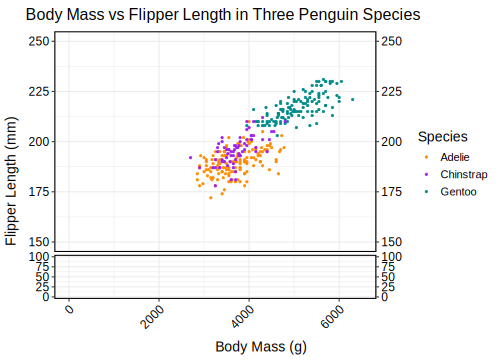

```{r setup, include=FALSE}
knitr::opts_chunk$set(echo = TRUE)
```

## Initialization

```{r loading of packages and data, warning=FALSE,message=FALSE}
library(tidyverse)
library(here)
library(palmerpenguins)
library(janitor)
library(ragg)
library(svglite)
library(plot3D)
library(ggbreak)

#loading custom functions
source(here("Functions", "cleaning.R"))
source(here("Functions", "plotting.R"))
source(here("Functions", "penguins.R"))

# loading data
write.csv(penguins_raw, here("Data","penguins_raw.csv"))

penguins_clean <- cleaning(penguins_raw,c("Comments", "Delta"))

write.csv(penguins_clean, here("data","penguins_clean.csv"))
```

*The following is a template .rmd RMarkdown file for you to use for your homework submission.*

*Please Knit your .rmd to a PDF format or HTML and submit that with no identifiers like your name.*

*To create a PDF, first install tinytex and load the package. Then press the Knit arrow and select "Knit to PDF".*

## QUESTION 01: Data Visualisation for Science Communication

*Create a figure using the Palmer Penguin dataset that is correct but badly communicates the data. **Do not make a boxplot**.*

*Use the following references to guide you:*

-   [*https://www.nature.com/articles/533452a*](https://www.nature.com/articles/533452a){.uri}
-   [*https://elifesciences.org/articles/16800*](https://elifesciences.org/articles/16800){.uri}

*Note: Focus on visual elements rather than writing misleading text on it.*

### a) Provide your figure here:

```{r bad figure code, echo=FALSE}

svglite(here("Figures", "Ugly graph.svg"), width = 5,
          height = 5,
          scaling = 1
        )
  scatter3D(penguins_clean$sample_number, penguins_clean$body_mass_g,
            penguins_clean$flipper_length_mm, 
            colvar = penguins_clean$culmen_depth_mm, 
            pch = 19, cex = 0.5, clab = "Culmen depth", 
            xlab = "sample number",ylab = "Body mass", 
            zlab = "flipper length", 
            colkey = list(side = 4, plot = TRUE, 
                          length = 0.5, width = 1, dist = -0.25,
                          shift = 0, addlines = FALSE, 
                          col.clab = NULL, cex.clab = par("cex.lab"),
                          side.clab = NULL, line.clab = NULL, 
                          adj.clab = NULL, font.clab = NULL)
            )
  dev.off()
```


### b) Write about how your design choices mislead the reader about the underlying data (200-300 words).

*Include references.*

-   axis not starting at 0 (even though can't see

    -   can exagerrate relationships

    -   obscures truth

    -   all 3 axis on different scales

-   legend covering up the graph

-   too much data

    -   2 different relationships being shown, can't see either clearly at all

    -   plotting the sample number that gives no information whatsoever

-   hard to read

    -   no grid lines

    -   3 dimensional makes it impossible

    -   using colours can't get quantitative view of

    -   bad for colour blind people

    -   very small

-   labels

    -   no title

    -   no axis points

    -   overlapping text

    -   text at strange angles which is hard to read

    -   no

------------------------------------------------------------------------

## QUESTION 2: Data Pipeline

*Write a data analysis pipeline in your .rmd RMarkdown file. You should be aiming to write a clear explanation of the steps, the figures visible, as well as clear code.*

*Your code should include the steps practiced in the lab session:*

-   *Load the data*

-   *Appropriately clean the data*

-   *Create an Exploratory Figure (**not a boxplot**)*

-   *Save the figure*

-   ***New**: Run a statistical test*

-   ***New**: Create a Results Figure*

-   *Save the figure*

*An exploratory figure shows raw data, such as the distribution of the data. A results figure demonstrates the stats method chosen, and includes the results of the stats test.*

*Between your code, communicate clearly what you are doing and why.*

*Your text should include:*

-   *Introduction*

-   *Hypothesis*

-   *Stats Method*

-   *Results*

-   *Discussion*

-   *Conclusion*

*You will be marked on the following:*

### a) Your code for readability and functionality

### b) Your figures for communication

### c) Your text communication of your analysis

*Below is a template you can use.*

------------------------------------------------------------------------

### Introduction

```{r Data Exploration, warning=FALSE, message=FALSE}
#loading, cleaning and saving data
write.csv(penguins_raw, here("Data", "penguins_raw.csv"))

penguins_clean <- cleaning(penguins_raw, c("Comments", "Delta"))

write.csv(penguins_clean, here("data", "penguins_clean.csv"))

#explorative plot and save

ExpPlot <- scatterplot(penguins_clean, penguins_clean$body_mass_g, 
                       "Body Mass (g)", 
                       penguins_clean$flipper_length_mm, 
                       "Flipper Length (mm)", penguins_clean$species, 
                       "Species", "Body Mass vs Flipper Length", 
                       FALSE, "Exploratory plot.svg", 5, 7, 1)

```



### Hypothesis

### Statistical Methods

```{r Statistics}
# statistical test
# Make sure your code prints. 

```

### Results & Discussion

```{r Plotting Results}
#plot results and save
# Make sure your code prints. 

```

### Conclusion

------------------------------------------------------------------------

## QUESTION 3: Open Science

### a) GitHub

*Upload your RProject you created for **Question 2** and any files and subfolders used to GitHub. Do not include any identifiers such as your name. Make sure your GitHub repo is public.*

*GitHub link:*

[https://github.com/The-Nedstar/ReproducableFigures](https://github.com/The-Nedstar/ReproducableFigures/tree/Dev){.uri}

*You will be marked on your repo organisation and readability.*

### b) Share your repo with a partner, download, and try to run their data pipeline.

*Partner's GitHub link:*

*You **must** provide this so I can verify there is no plagiarism between you and your partner.*

### c) Reflect on your experience running their code. (300-500 words)

-   *What elements of your partner's code helped you to understand their data pipeline?*

-   *Did it run? Did you need to fix anything?*

-   *What suggestions would you make for improving their code to make it more understandable or reproducible, and why?*

-   *If you needed to alter your partner's figure using their code, do you think that would be easy or difficult, and why?*

### d) Reflect on your own code based on your experience with your partner's code and their review of yours. (300-500 words)

-   *What improvements did they suggest, and do you agree?*

-   *What did you learn about writing code for other people?*
